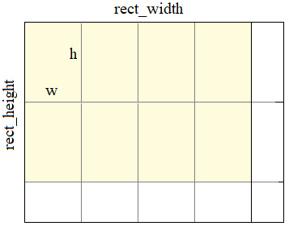

# 2.7 Операции деления по модулю, инкремента и декремента. Задачи

## Task 2 - Подвиг 2

* Продолжите программу, в которой выполняется чтение целочисленного неотрицательного значения в переменную angle (угол). Необходимо представить угол angle в диапазоне [0; 359]. То есть, все значения в 360 вычесть из переменной angle.  
Например:  
\tangle = 540; 540 - 360 = 180;  
\tangle = 800; 800 - 2*360 = 80.  
Результат вывести в консоль в виде одного полученного целого числа.  
Тесты: https://github.com/selfedu-rus/c-tests/tree/main/2.7.2  

## Task 3 - Подвиг 3

* На плоскости размером rect_width на rect_height (ширина x высота) размещены непересекающиеся прямоугольники одинаковых размеров w x h, следующих друг за другом, как показано на рисунке ниже.
  
Необходимо продолжить программу, вычислив оставшуюся ширину и высоту не покрытую целыми прямоугольниками. Результат вывести в консоль в виде двух целых чисел в одну строчку через пробел.  
Тесты: https://github.com/selfedu-rus/c-tests/tree/main/2.7.3  

## Task 4 - Подвиг 4

* Необходимо продолжить программу, которая складывает время, указанное в часах, минутах и секундах. Исходное время хранится в переменных time_h, time_m, time_s, а добавляемое - в переменных h, m, s. Гарантируется, что сумма времен не превышает одни сутки. Вывести полученное суммарное время в консоль в формате:  
hh:mm:ss  
Например:  
12:05:09  
(обратите внимание на наличие незначащих нулей при выводе чисел меньше 10).  
Тесты: https://github.com/selfedu-rus/c-tests/tree/main/2.7.4  

## Task 8 - Подвиг 8

* Напишите программу, которая читает из стандартного входного потока вещественное значение в некоторую переменную. Затем, запишите функцию printf(), в которой сразу уменьшите значение переменной на единицу и выведите в консоль с точностью до десятых.  
Тесты: https://github.com/selfedu-rus/c-tests/tree/main/2.7.8  

## Task 9 - Подвиг 9

* Напишите программу, которая читает из стандартного входного потока два целых значения, записанных через запятую, в две переменные h и w. Затем, запишите функцию printf(), в которой сразу вычислите произведение этих двух переменных, увеличенных на единицу (то есть, значение каждой переменной сначала увеличивается на 1, а затем, они перемножаются) и выведите результат в консоль в виде одного целого числа.  
Тесты: https://github.com/selfedu-rus/c-tests/tree/main/2.7.9  

## Task 10 - Подвиг 10 (на повторение)

* На плоскости размером rect_width x rect_height (ширина x высота) размещены непересекающиеся прямоугольники одинаковых размеров w x h, следующих друг за другом, как показано на рисунке ниже.  
  
Необходимо продолжить программу, вычислив общее число прямоугольников целиком умещающихся на плоскости. Результат вывести в консоль в виде одного целого числа.
