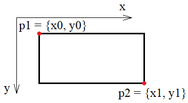
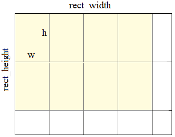

# 3.1 Булевый тип. Операции сравнения. Логические И, ИЛИ, НЕ. Задачи - Tasks

## Task 4 - Подвиг 4

* Напишите программу, которая считывает из входного потока stdin целое число и выводит в консоль значение 100, если число кратно 5, и 0 в противном случае.  
P.S. Программу реализовать без применения условных операторов.  
Тесты: https://github.com/selfedu-rus/c-tests/tree/main/3.1.4  
**Sample Input:**  
    15  
**Sample Output:**  
    100  

## Task 5 - Подвиг 5

* Напишите программу, которая считывает из входного потока stdin вещественное число. Если его целая часть кратна 5, то в консоль следует вывести число 1, иначе - число 0.  
P.S. Программу реализовать без применения условных операторов.  
Тесты: https://github.com/selfedu-rus/c-tests/tree/main/3.1.5  
**Sample Input:**  
    25.44  
**Sample Output:**  
    1  

## Task 7 - Подвиг 7

* Напишите программу, которая считывает из входного потока stdin вещественное число и выводит в консоль значение 1, если число принадлежит диапазону [-5.45; 10.37], и 0 в противном случае.  
P.S. Программу реализовать без применения условных операторов.  
Тесты: https://github.com/selfedu-rus/c-tests/tree/main/3.1.7  
**Sample Input:**  
    -5.44  
**Sample Output:**  
    1  

## Task 8 - Подвиг 8

* Напишите программу, которая считывает из входного потока stdin вещественное число и выводит в консоль значение 1, если число принадлежит диапазону [-10; 0) или (5; 12], и 0 в противном случае.  
**Ликбез:** [a; b] - диапазон, включающий граничные значения; (a; b) - диапазон не включающий граничные значения.  
P.S. Программу реализовать без применения условных операторов.  
Тесты: https://github.com/selfedu-rus/c-tests/tree/main/3.1.8  
**Sample Input:**  
    -10  
**Sample Output:**  
    1  

## Task 9 - Подвиг 9

* Напишите программу, которая считывает из входного потока stdin два вещественных числа x, y, записанных в одну строчку через пробел, и выводит в консоль значение 1, если координаты (x, y) находятся внутри прямоугольника с координатами верхнего левого угла (-5, 0) и правого нижнего (10, 7). В противном случае выводится число 0.  
  
P.S. Программу реализовать без применения условных операторов.  
Тесты: https://github.com/selfedu-rus/c-tests/tree/main/3.1.9  
**Sample Input:**  
    -4.9 0.1  
**Sample Output:**  
    1  

## Task 10 - Подвиг 10

* Напишите программу, которая считывает из входного потока stdin два вещественных числа x, y и выводит в консоль значение 1, если координаты (x, y) не находятся внутри прямоугольника с координатами верхнего левого угла (-5, 0) и правого нижнего (10, 7). В противном случае выводится число 0.  
P.S. Программу реализовать без применения условных операторов.  
Тесты: https://github.com/selfedu-rus/c-tests/tree/main/3.1.10  
**Sample Input:**  
    -4.9 -0.1  
**Sample Output:**  
    1  

## Task 11 - Подвиг 11*

* На плоскости размером rect_width x rect_height (ширина x высота) размещены непересекающиеся прямоугольники одинаковых размеров w x h, следующих друг за другом, как показано на рисунке ниже.  
  
Необходимо продолжить программу, вычислив общее число прямоугольников не умещающихся целиком на плоскости. Результат вывести в консоль в виде одного целого числа.  
P.S. Программу реализовать без применения условных операторов, только используя изученный материал.  
Тесты: https://github.com/selfedu-rus/c-tests/tree/main/3.1.11  
**Sample Input:**  
    23; 44  
**Sample Output:**  
    38  
